# Modelos de Arquitetura de Software - Fluxos em Mermaid

## 1. Arquitetura Monolítica

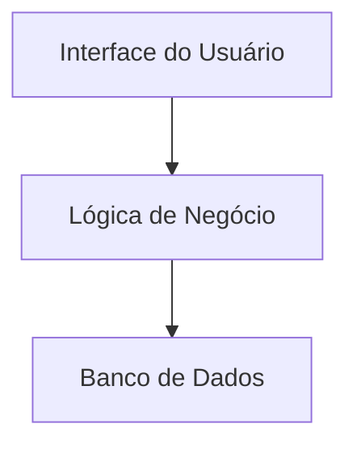

## 2. Arquitetura em Camadas (Layered)

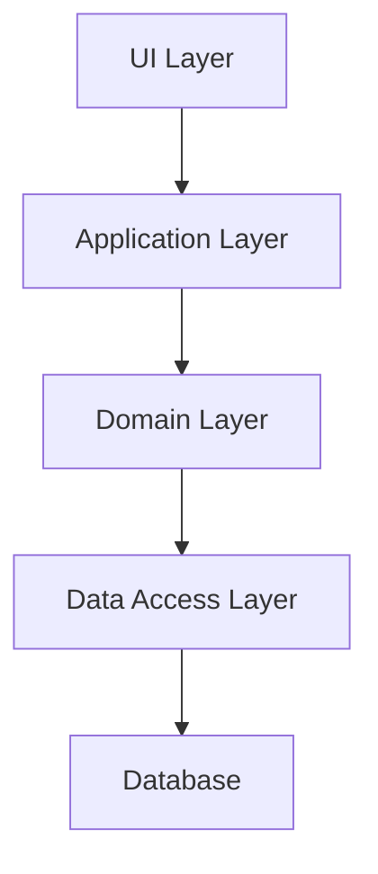

## 3. Arquitetura Modular

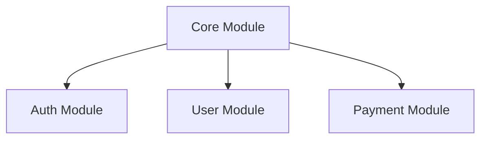

## 4. Microkernel

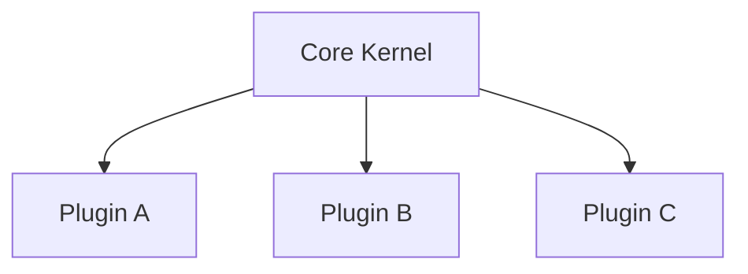

## 5. Cliente-Servidor

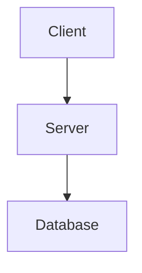

## 28. Arquitetura Baseada em Componentes

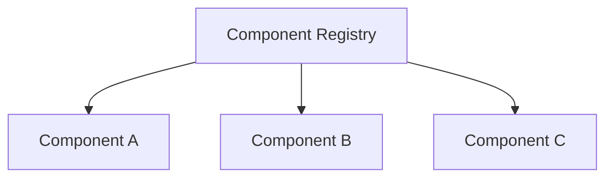

## 29. Arquitetura em Mall

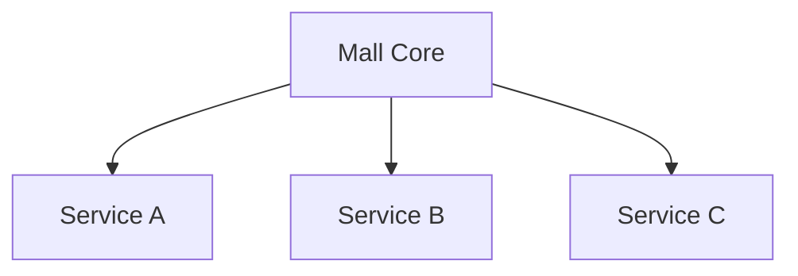

## 30. Arquitetura de Nuvem Híbrida

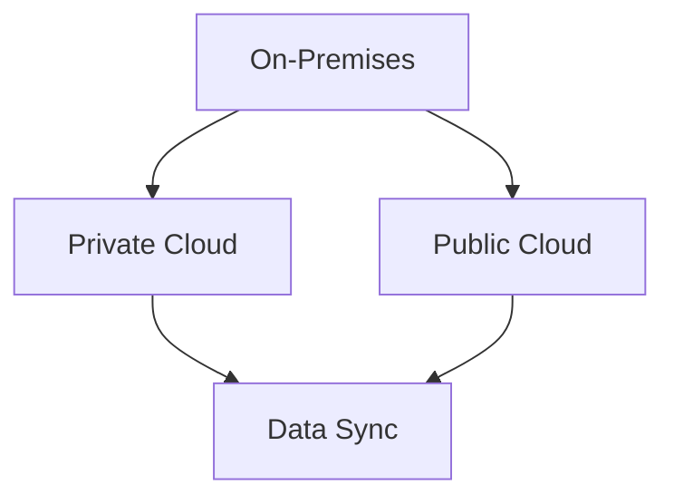

## 31. Arquitetura Big Data

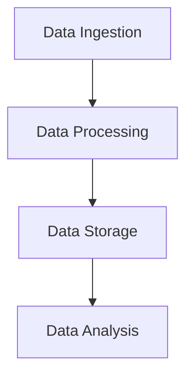

## 32. Arquitetura Multi-Tenant

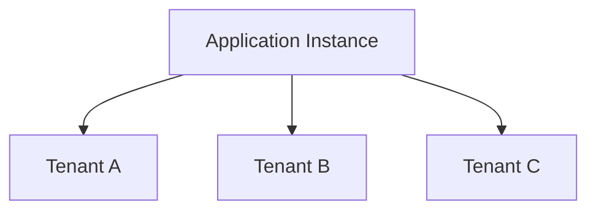

## 33. Arquitetura IoT

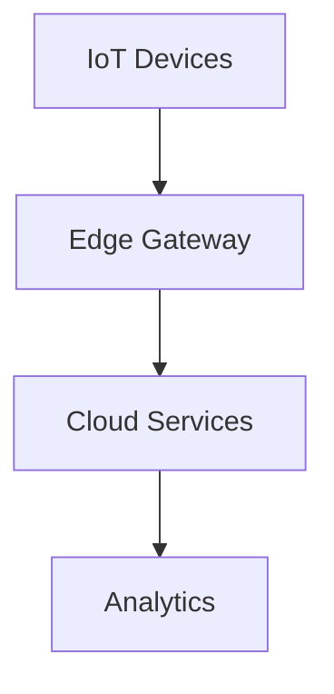

## 34. Arquitetura de Sistemas Reativos

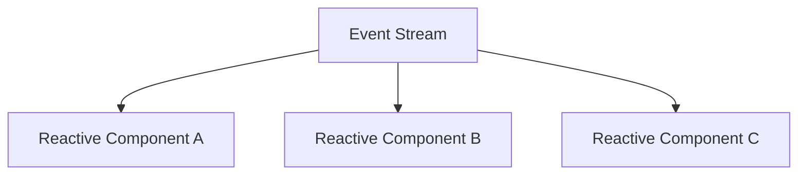

## 35. Arquitetura Orientada a Agentes

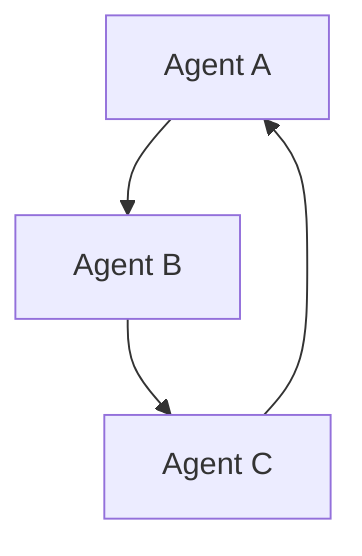

## 36. Arquitetura de Referência TOGAF

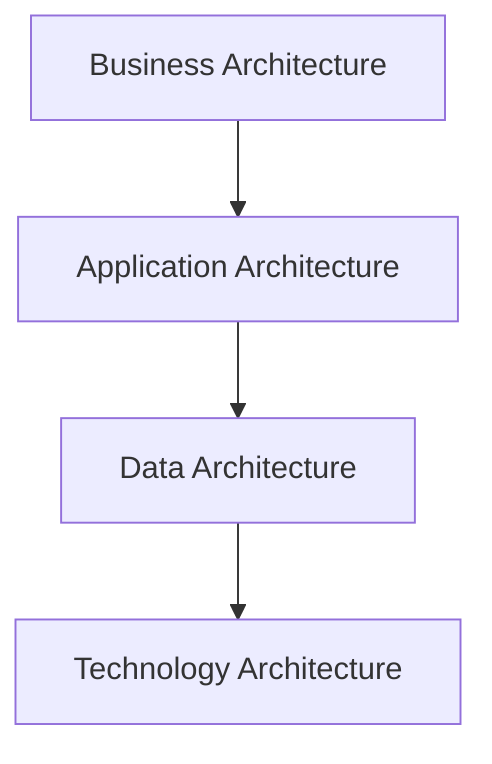

## 37. Arquitetura Orientada a Serviços em Nuvem (SOA Cloud)

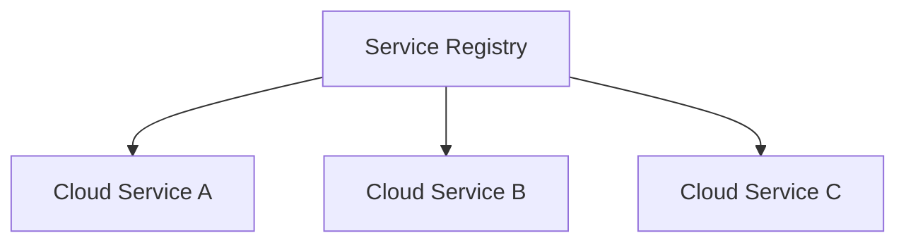
