# Modelos de Arquitetura de Software - Fluxos em Mermaid

## 1. Arquitetura Monolítica

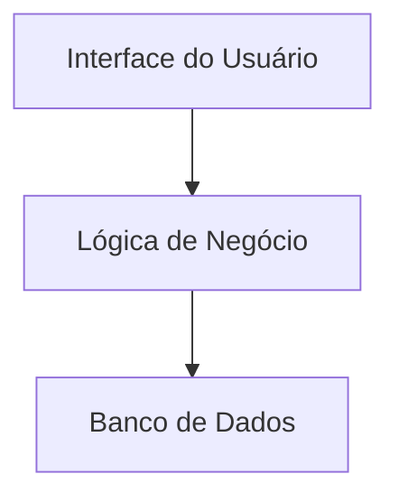

## 2. Arquitetura em Camadas (Layered)

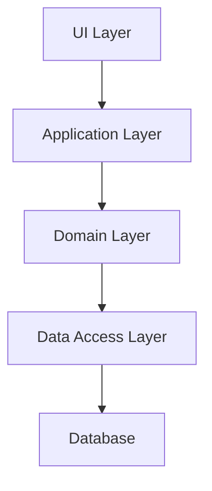

## 3. Arquitetura Modular

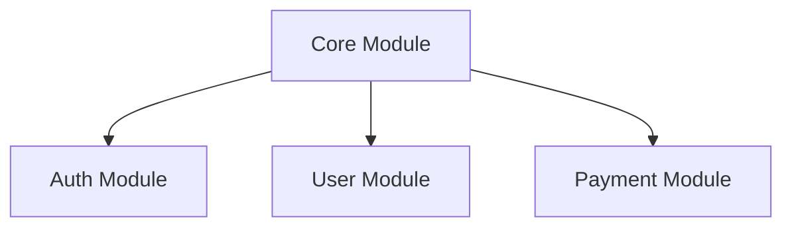

## 4. Microkernel

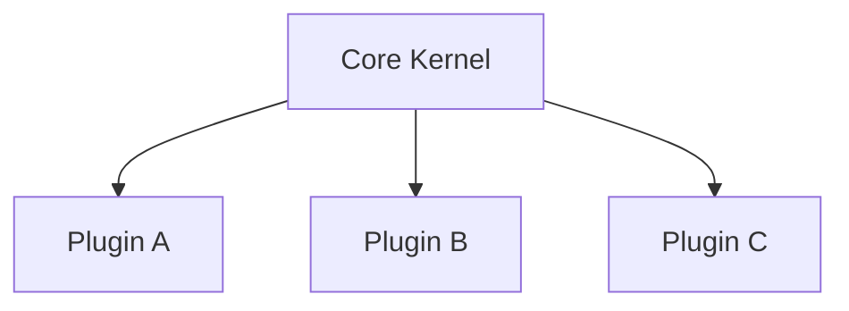

## 5. Cliente-Servidor

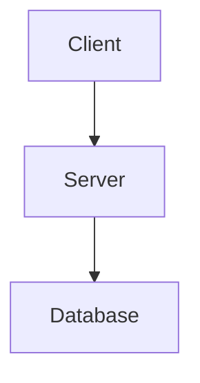

## 6. P2P (Peer-to-Peer)

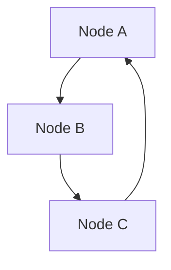

## 7. SOA (Service-Oriented Architecture)

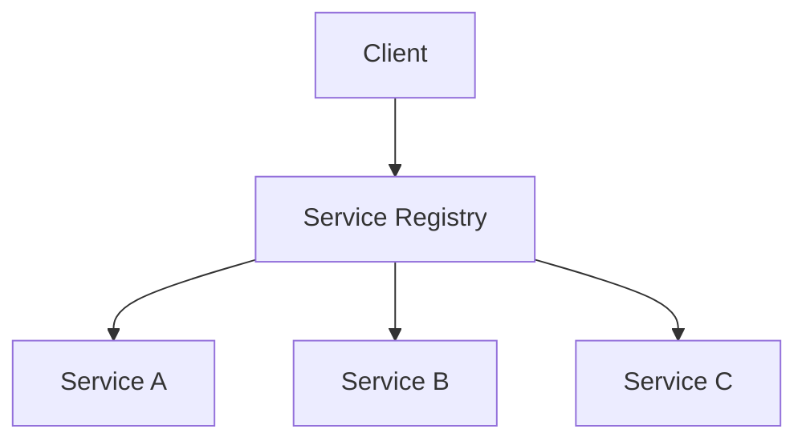

## 8. Microserviços

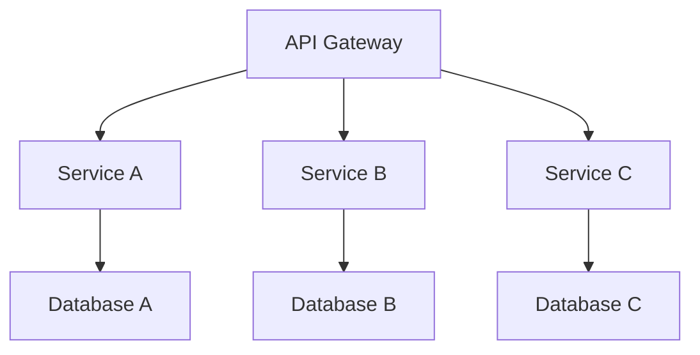

## 9. Serverless

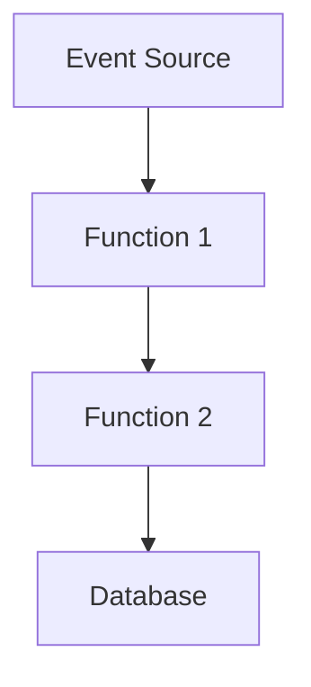

## 10. Data-Centric

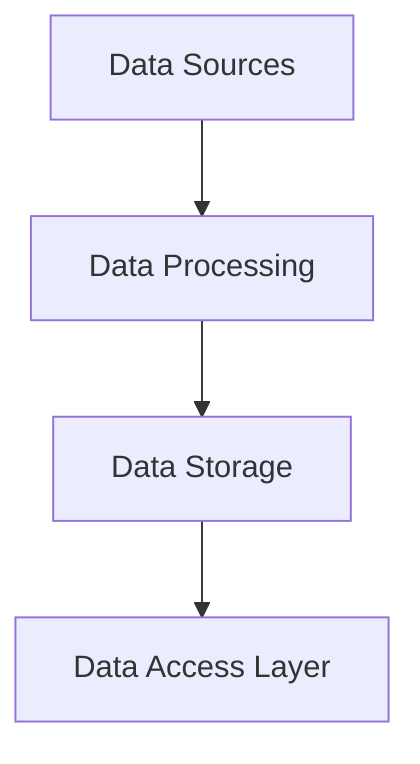

## 11. ETL

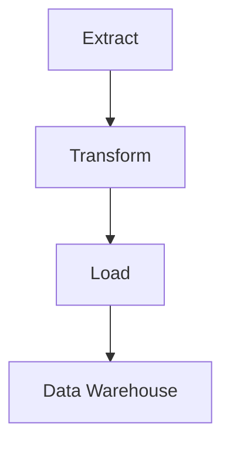

## 12. Data Lake

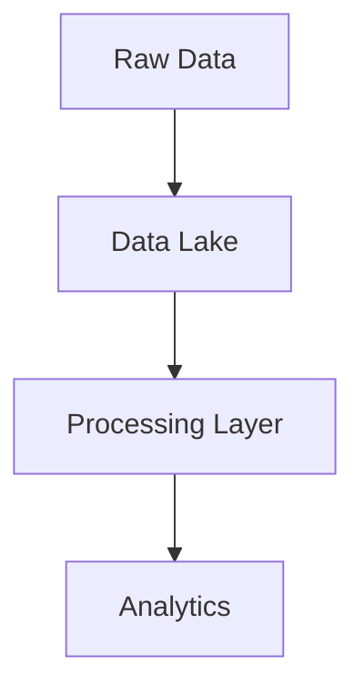

## 13. Data Warehouse

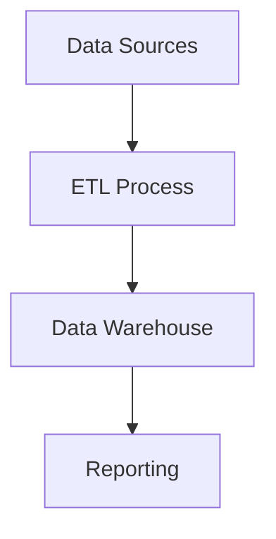

## 14. DDD (Domain-Driven Design)

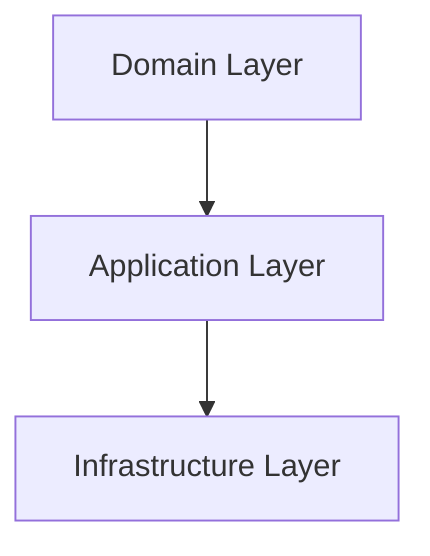

## 15. Arquitetura Hexagonal

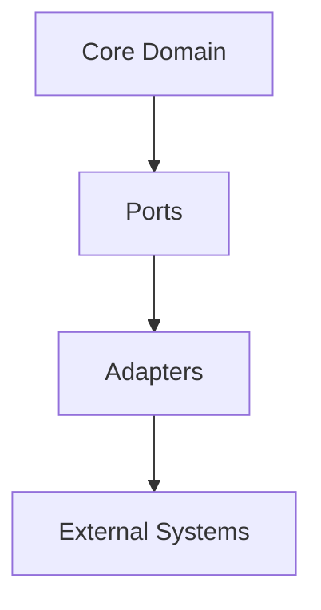

## 16. CQRS

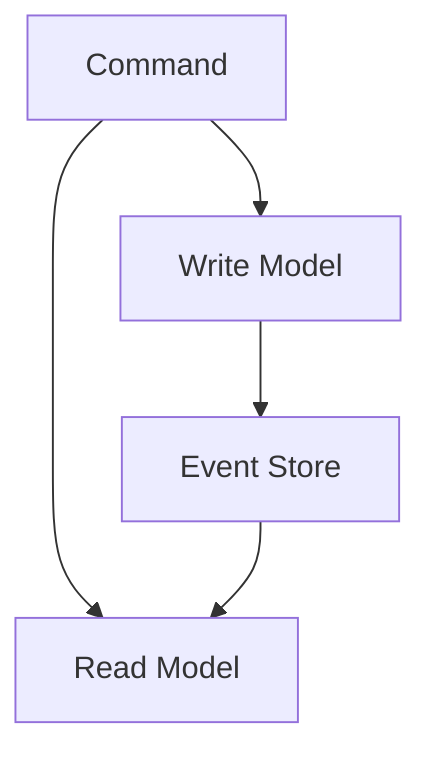

## 17. Event Sourcing

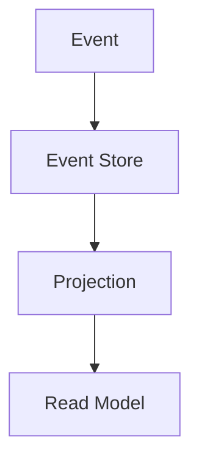

## 18. Event-Driven

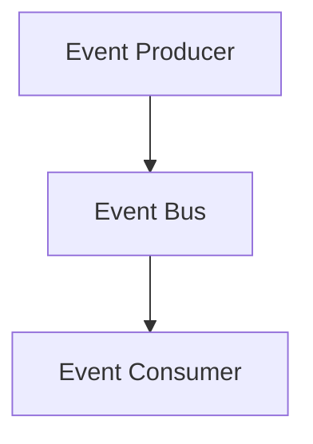

## 19. Stream Processing

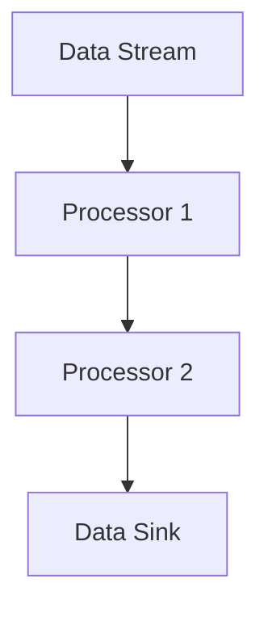

## 20. Actor Model

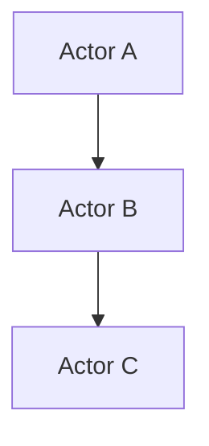

## 21. Clean Architecture

```mermaid
graph TD
    A[Entities] --> B[Use Cases]
    B --> C[Interface Adapters]
    C --> D[Frameworks & Drivers]
```

## 22. Onion Architecture

```mermaid
graph TD
    A[Core] --> B[Domain]
    B --> C[Application Services]
    C --> D[Infrastructure]
```

## 23. Serverless Event-Driven

```mermaid
graph TD
    A[Event Source] --> B[Function]
    B --> C[Data Store]
```

## 24. Micro Frontend

```mermaid
graph TD
    A[App Shell] --> B[Frontend 1]
    A --> C[Frontend 2]
    A --> D[Frontend 3]
```

## 25. Lambda Architecture

```mermaid
graph TD
    A[Data Stream] --> B[Batch Processing]
    A --> C[Real-Time Processing]
    B --> D[Data Warehouse]
    C --> D
    D --> E[Analytics]
```

## 26. Edge Computing

```mermaid
graph TD
    A[Edge Device] --> B[Edge Server]
    B --> C[Cloud Server]
```

## 27. Space-Based Architecture

```mermaid
graph TD
    A[Data Grid] --> B[Processing Unit 1]
    A --> C[Processing Unit 2]
    B --> D[Data Store]
    C --> D
```
